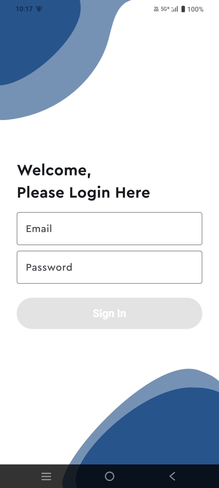
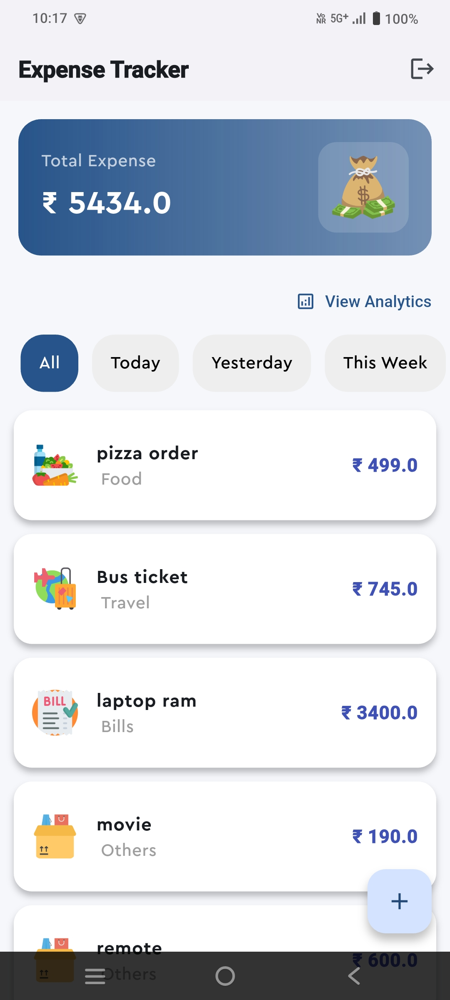
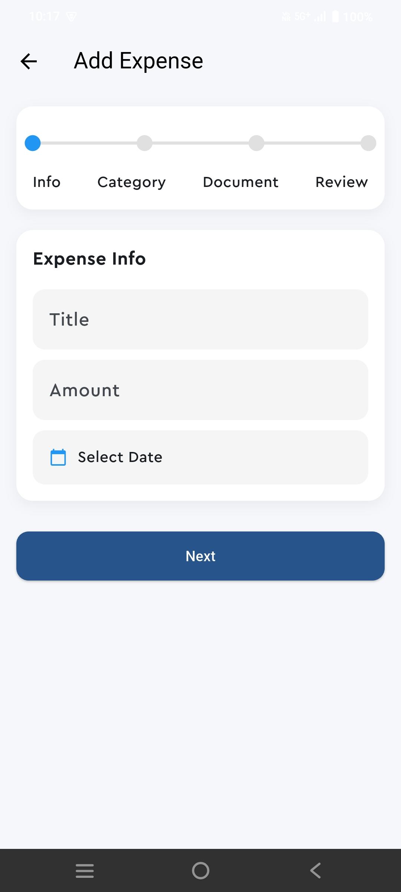
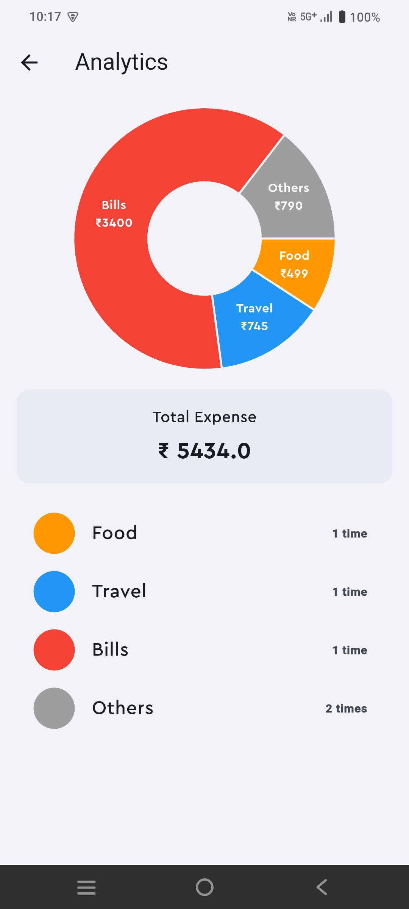

# 💸 Expense Tracker App

A modern Flutter-based expense tracking application that helps users manage daily spending, categorize expenses, and gain insights through analytics.

---

## 🚀 Features

-  Authentication (Login / Logout) *(Firebase Auth ready)*
-  Add and manage expenses
-  Category-based tracking (Food, Travel, Bills, etc.)
-  Filter expenses (Today, Yesterday, Weekly, Monthly)
-  Analytics with charts (category-wise insights)
-  Expense detail view with document support
-  Local storage using Hive (offline support)
-  Firebase integration (for future cloud sync & auth)
-  Clean and modern UI

---

## Tech Stack

- Flutter
- Riverpod (State Management)
- Hive (Local Database)
- Firebase (Auth / storage / firestore)
- fl_chart (Analytics)

---

## 📸 Screenshots

| Login | Dashboard | Add Expense | Analytics |
|------|----------|------------|----------|
|  |  |  |  |

---

## 🛠️ Setup Instructions

### 1. Clone the repository
```bash
git clone https://github.com/Cva-Murugan/Expense-Tracker.git

cd Expense-Tracker

flutter pub get

flutter run
